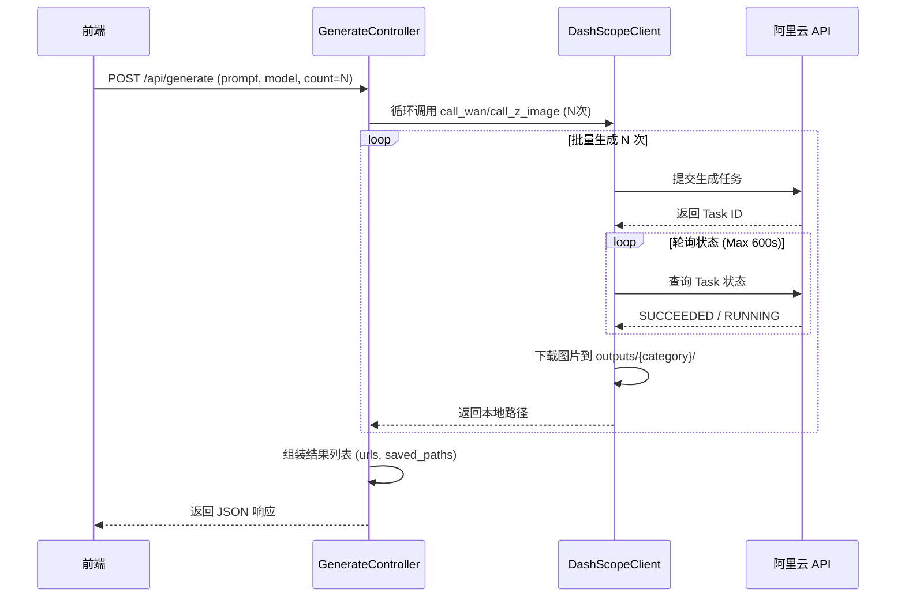

# 后端功能实现与业务逻辑文档

## 1. 系统架构概述

本项目后端采用 **FastAPI** 框架构建，遵循标准的 **MVC (Model-View-Controller)** 分层架构设计，确保代码的高内聚低耦合。

### 1.1 技术栈
- **Web 框架**: FastAPI (Python 3.10+)
- **API 规范**: RESTful API
- **数据验证**: Pydantic
- **图像处理**: Pillow (PIL)
- **AI 服务集成**: Aliyun DashScope SDK (通义万相, Qwen, Z-Image)
- **服务器**: Uvicorn (ASGI)

### 1.2 目录结构
```
backend/
├── config/             # 配置管理 (Settings)
├── controllers/        # 控制器层 (路由分发与请求处理)
├── models/             # 数据模型层 (Request/Response DTOs)
├── services/           # 业务服务层 (核心逻辑实现)
├── utils/              # 工具函数库
└── bankmcp/            # 兼容层 (适配旧接口)
```

---

## 2. 功能实现清单

后端功能模块与前端需求一一对应，主要包含以下四大核心模块：

### 2.1 模型管理模块 (Model Registry)
- **功能**: 提供系统支持的 AI 模型列表。
- **实现**: 读取配置文件 (`config.json` / `config.local.json`) 中的模型定义。
- **接口**: `GET /api/models`
- **对应代码**: `controllers/models_controller.py`, `services/model_registry_service.py`

### 2.2 多模式生成模块 (Generation)
- **功能**: 处理文生图请求，支持单张/批量生成。
- **支持模型**:
  - **Wan (通义万相)**: 适合通用高质量图像生成。
  - **Z-Image**: 适合特定风格或扩展提示词生成。
  - **Qwen**: 仅用于文本生成（辅助）。
- **特性**:
  - **批量生成**: 支持通过 `count` 参数一次性生成多张图片。
  - **自动下载**: 生成完成后自动将图片下载至本地 `outputs/{category}/` 目录。
  - **异步轮询**: 针对长耗时任务（如 Wan 模型），后端自动轮询任务状态直至完成。
- **接口**: `POST /api/generate`
- **对应代码**: `controllers/generate_controller.py`, `services/dashscope_client_service.py`

### 2.3 智能翻译模块 (Translation)
- **功能**: 提供中英互译功能，辅助用户编写提示词。
- **实现**: 调用 Qwen 大模型进行语义翻译。
- **接口**: `POST /api/translate`
- **对应代码**: `controllers/translate_controller.py`, `services/translation_service.py`

### 2.4 图片管理模块 (Image Management)
- **功能**: 浏览本地生成的历史图片，提供高性能缩略图服务。
- **特性**:
  - **缩略图缓存**: 首次访问自动生成缩略图并缓存至 `.thumbs/` 目录，后续直接读取。
  - **智能ID**: 使用 Base64 编码文件路径作为图片 ID，安全且唯一。
  - **透明处理**: 自动将透明背景图片（RGBA）转换为白色背景（RGB）生成缩略图。
- **接口**:
  - `GET /api/images`: 获取图片列表。
  - `GET /api/images/{id}/thumb`: 获取缩略图。
  - `GET /api/images/{id}/raw`: 获取原图。
- **对应代码**: `controllers/images_controller.py`

---

## 3. 业务逻辑详解

### 3.1 图像生成流程 (Generation Flow)



### 3.2 缩略图生成与缓存机制

1.  **请求**: 用户请求 `GET /api/images/{id}/thumb?size=512`。
2.  **解码**: 控制器将 `id` (Base64) 解码为真实文件路径。
3.  **缓存检查**:
    -   计算缩略图缓存路径：`outputs/.thumbs/512/{category}/{filename}.jpg`。
    -   如果文件存在，直接返回文件流。
4.  **生成 (Cache Miss)**:
    -   使用 `PIL.Image` 打开原图。
    -   如果是 RGBA 模式，创建白色背景并合成。
    -   调用 `thumbnail((512, 512))` 进行等比缩放。
    -   保存为 JPEG 格式到缓存路径。
5.  **响应**: 返回生成的缩略图文件。

---

## 4. 核心接口定义 (API Specs)

### 4.1 生成请求 (GenerateRequest)
```python
class GenerateRequest(BaseModel):
    service: str          # 服务类型: "wan" | "z_image" | "qwen"
    prompt: str           # 提示词
    model: Optional[str]  # 具体模型名
    category: str         # 分类目录 (默认: "default")
    size: str             # 尺寸 (如 "1024*1024")
    count: int            # 生成数量 (1-50, 默认 1)
    negative_prompt: str  # 负向提示词
```

### 4.2 图片对象 (ImageItem)
```python
{
    "id": "Base64String...",  # 唯一标识
    "url": "/api/images/{id}/thumb",       # 缩略图链接
    "originalUrl": "/api/images/{id}/raw", # 原图链接
    "category": "people",     # 分类
    "filename": "img_123.png",# 文件名
    "timestamp": 1712345678   # 修改时间
}
```

---

## 5. 数据存储结构

系统所有生成内容均存储在本地文件系统：

```
outputs/
├── .thumbs/              # [系统生成] 缩略图缓存目录
│   └── 512/              # 按尺寸分类
│       ├── people/       # 对应原图分类
│       └── animals/
├── people/               # 用户分类: 人物
│   ├── wan_1710001.png   # 生成的原图
│   └── z_image_1710002.png
├── animals/              # 用户分类: 动物
└── default/              # 默认分类
```
